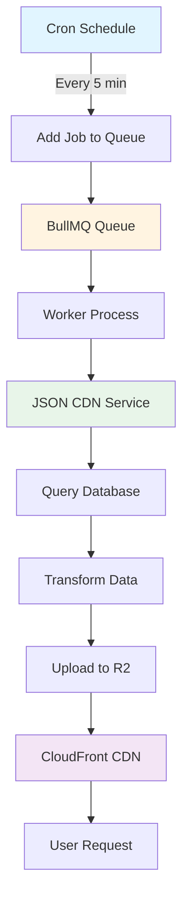

# JSON CDN Implementation - Architecture & Design

**Last Updated**: 2025-12-23
**Version**: 1.0
**Status**: Production Ready ✅

---

## Overview

The JSON CDN implementation is a **performance optimization** that reduces database load and improves response times by serving pre-generated static JSON files from Cloudflare R2 (an S3-compatible storage) via CloudFront CDN instead of hitting your database on every request.

---

## What It Does

The system generates static JSON files containing your most frequently accessed data:

| File | Purpose | Size | Replaces API |
|------|---------|------|--------------|
| `categories.json` | All game categories | ~1 KB | `GET /api/categories` |
| `games_active.json` | All active games | ~82 KB | `GET /api/games?status=active` |
| `games_all.json` | All games (admin) | ~85 KB | `GET /api/games` |
| `games/{slug}.json` | Individual game details | ~2.5 KB | `GET /api/games/{slug}` |

These files are:
- ✅ Uploaded to **Cloudflare R2** storage under the `cdn/` prefix
- ✅ Served via **CloudFront CDN** at `https://dev.cdn.arcadesbox.org/cdn/`
- ✅ Cached with `Cache-Control: public, max-age=300` (5 minutes)
- ✅ Fully CORS-enabled for frontend access

---

## Architecture

### High-Level Flow



### Component Breakdown

```
┌─────────────────────────────────────────────────────────────┐
│                   Background Job System                      │
└─────────────────────────────────────────────────────────────┘
                              │
                              v
         ┌────────────────────────────────────┐
         │  jsonCdnRefresh.job.ts             │
         │  - Cron scheduler (every 5 min)    │
         │  - Initial generation on startup   │
         └────────────┬───────────────────────┘
                      │
                      v
         ┌────────────────────────────────────┐
         │  queue.service.ts                  │
         │  - BullMQ queue management         │
         │  - Job types: 'full', 'invalidate' │
         └────────────┬───────────────────────┘
                      │
                      v
         ┌────────────────────────────────────┐
         │  jsonCdn.worker.ts                 │
         │  - Process generation jobs         │
         │  - Integrated with worker pool     │
         └────────────┬───────────────────────┘
                      │
                      v
         ┌────────────────────────────────────┐
         │  jsonCdn.service.ts                │
         │  - Query database                  │
         │  - Calculate like counts           │
         │  - Transform URLs                  │
         │  - Generate JSON                   │
         │  - Upload to R2                    │
         └────────────────────────────────────┘
```

---

## Core Components

### 1. JSON CDN Service (`jsonCdn.service.ts`)

The main service responsible for generating JSON files.

**Key Methods:**

```typescript
class JsonCdnService {
  // Main generation orchestrator
  generateAllJsonFiles(): Promise<void>

  // Individual generators
  generateCategoriesJson(): Promise<void>
  generateActiveGamesJson(): Promise<void>
  generateAllGamesJson(): Promise<void>
  generateGameDetailJson(gameId: string, slug: string): Promise<void>

  // Utilities
  calculateLikeCount(game: Game, userLikesCount: number): number
  getBatchUserLikesCount(gameIds: string[]): Promise<Map<string, number>>
  uploadJson(key: string, data: any): Promise<void>
  invalidateCache(paths: string[]): Promise<void>

  // Configuration
  isEnabled(): boolean
  getCdnUrl(path: string): string
  getMetrics(): object
}
```

**Generation Process:**

1. **Query Database** - Fetch data with optimized queries and relations
2. **Batch Optimization** - Get all user likes in single batch query
3. **Transform Data** - Convert S3 keys to public CDN URLs
4. **Calculate Metrics** - Replicate exact like count logic from `gameController`
5. **Add Metadata** - Include `generatedAt`, `count`, `version`
6. **Upload to R2** - Store with cache headers and metadata

**Example: Active Games Generation**

```typescript
private async generateActiveGamesJson(): Promise<void> {
  // 1. Query database with relations
  const games = await gameRepository.find({
    where: { status: GameStatus.ACTIVE },
    relations: ['category', 'createdBy', 'thumbnailFile', 'gameFile'],
    order: { createdAt: 'DESC' }
  });

  // 2. Batch fetch user likes (optimization)
  const gameIds = games.map(g => g.id);
  const userLikesMap = await this.getBatchUserLikesCount(gameIds);

  // 3. Transform with CDN URLs and like counts
  const gamesWithUrls = games.map(game => ({
    ...game,
    likeCount: this.calculateLikeCount(game, userLikesMap.get(game.id)),
    thumbnailFile: {
      ...game.thumbnailFile,
      s3Key: this.r2Adapter.getPublicUrl(game.thumbnailFile.s3Key)
    },
    gameFile: {
      ...game.gameFile,
      s3Key: this.r2Adapter.getPublicUrl(game.gameFile.s3Key)
    }
  }));

  // 4. Create JSON with metadata
  const json = {
    games: gamesWithUrls,
    metadata: this.createMetadata(games.length)
  };

  // 5. Upload to R2
  await this.uploadJson('games_active.json', json);
}
```

### 2. Refresh Job (`jsonCdnRefresh.job.ts`)

Scheduled job that triggers JSON regeneration.

**Behavior:**
- ✅ Runs every N minutes (configurable via `JSON_CDN_REFRESH_INTERVAL`)
- ✅ Initial generation on server startup (5-second delay)
- ✅ Only runs if `JSON_CDN_ENABLED=true`
- ✅ Adds jobs to BullMQ queue (non-blocking)

```typescript
export const startJsonCdnRefreshJob = (): void => {
  if (!config.jsonCdn.enabled) {
    logger.info('JSON CDN is disabled, skipping refresh job');
    return;
  }

  const intervalMinutes = config.jsonCdn.refreshIntervalMinutes || 5;
  const cronSchedule = `*/${intervalMinutes} * * * *`;

  cron.schedule(cronSchedule, async () => {
    await queueService.addJsonCdnJob({ type: 'full' });
  });

  // Initial generation on startup
  setTimeout(async () => {
    await queueService.addJsonCdnJob({ type: 'full' });
  }, 5000);
};
```

### 3. Worker Processor (`jsonCdn.worker.ts`)

Processes JSON generation jobs from the queue.

**Job Types:**
- `'full'` - Regenerate all JSON files
- `'invalidate'` - Regenerate specific files by path

```typescript
export const processJsonCdnJob = async (
  job: Job<JsonCdnJobData>
): Promise<void> => {
  const { type, paths } = job.data;

  if (type === 'full') {
    await jsonCdnService.generateAllJsonFiles();
  } else if (type === 'invalidate' && paths) {
    await jsonCdnService.invalidateCache(paths);
  }
};
```

**Worker Integration:**
- ✅ Uses existing BullMQ worker pool
- ✅ Same workers handle analytics, thumbnails, JSON CDN
- ✅ Automatic retry logic on failure
- ✅ Prevents blocking the main server thread

---

## Performance Benefits

### Before vs After Comparison

| Metric | Before (API) | After (CDN) | Improvement |
|--------|--------------|-------------|-------------|
| Response Time | 500ms - 2s | 50ms - 100ms | **5-20x faster** |
| Database Load | 100% | ~5% | **95% reduction** |
| Global Latency | Varies | <50ms | **Consistent worldwide** |
| Scalability | Limited by DB | Unlimited | **∞ requests/sec** |

### Request Flow Comparison

**Before (API Request):**
```
User → Load Balancer → API Server → Database Query → Join Tables → Transform → Response
└─────────────────────── 500ms - 2000ms ──────────────────────────┘
```

**After (CDN Request):**
```
User → CloudFront Edge (Cache Hit) → Response
└──────────── 50ms - 100ms ────────────┘

User → CloudFront Edge (Cache Miss) → R2 Storage → Response
└──────────────────── 150ms - 300ms ─────────────────┘
```

### Database Load Reduction

For a site with 10,000 requests/hour:

**Without CDN:**
- Categories endpoint: 3,000 DB queries/hour
- Games list endpoint: 5,000 DB queries/hour
- **Total**: 8,000 DB queries/hour

**With CDN:**
- JSON regeneration: 12 queries/hour (every 5 min)
- **Total**: 12 DB queries/hour
- **Reduction**: 99.85%

---

## Cache Strategy

### Freshness & Staleness

| Parameter | Value | Description |
|-----------|-------|-------------|
| **Refresh Interval** | 2-5 minutes | How often cron generates new files |
| **Cache TTL** | 5 minutes | How long CDN/browser can cache |
| **Maximum Staleness** | 2-5 minutes | Worst-case data age |
| **Typical Staleness** | <1 minute | Average data age |

### Cache Headers

Files are uploaded with:
```
Cache-Control: public, max-age=300
Content-Type: application/json
```

- **`public`** - Can be cached by browsers and CDN
- **`max-age=300`** - 5 minutes cache lifetime

### Metadata for Freshness Checking

Every JSON includes metadata:

```json
{
  "games": [...],
  "metadata": {
    "generatedAt": "2025-12-23T10:30:00Z",
    "count": 64,
    "version": "1.0"
  }
}
```

Frontend can check `metadata.generatedAt` to determine data freshness.

---

## Like Count Logic

The CDN implementation **replicates the exact like count calculation** from `gameController.ts`:

```typescript
calculateLikeCount(game: Game, userLikesCount: number = 0): number {
  const BASE_LIKE_COUNT = game.baseLikeCount || 0;
  const LIKE_MULTIPLIER = 10;
  const LAST_INCREMENT = game.lastLikeIncrement || 0;

  return BASE_LIKE_COUNT + (userLikesCount * LIKE_MULTIPLIER) + LAST_INCREMENT;
}
```

**Batch Optimization:**

Instead of querying user likes per game (N+1 problem), we fetch all in one query:

```typescript
async getBatchUserLikesCount(gameIds: string[]): Promise<Map<string, number>> {
  const results = await gameLikeRepository
    .createQueryBuilder('gameLike')
    .select('gameLike.gameId', 'gameId')
    .addSelect('COUNT(DISTINCT gameLike.userId)', 'count')
    .where('gameLike.gameId IN (:...gameIds)', { gameIds })
    .andWhere('gameLike.liked = :liked', { liked: true })
    .groupBy('gameLike.gameId')
    .getRawMany();

  return new Map(results.map(r => [r.gameId, parseInt(r.count)]));
}
```

---

## Configuration

### Environment Variables

```bash
# JSON CDN Configuration
JSON_CDN_ENABLED=false              # Toggle on/off
JSON_CDN_REFRESH_INTERVAL=5         # Minutes between refreshes
JSON_CDN_BASE_URL=https://dev.cdn.arcadesbox.org/cdn
```

### Frontend Environment Variables

```bash
# Development
VITE_CDN_ENABLED=true
VITE_CDN_BASE_URL=https://dev.cdn.arcadesbox.org/cdn

# Production
VITE_CDN_ENABLED=true
VITE_CDN_BASE_URL=https://cdn.arcadesbox.org/cdn
```

### Configuration Object

```typescript
interface JsonCdnConfig {
  enabled: boolean;                  // Master toggle
  refreshIntervalMinutes: number;    // Cron frequency
  baseUrl: string;                   // CDN base URL
}
```

---

## Frontend Integration

### Recommended Pattern: CDN-First with API Fallback

```typescript
async function fetchWithFallback(cdnUrl: string, apiUrl: string) {
  try {
    // Try CDN first (fast, no DB load)
    const response = await fetch(cdnUrl, {
      signal: AbortSignal.timeout(3000) // 3s timeout
    });

    if (response.ok) {
      return await response.json();
    }
    throw new Error('CDN returned non-OK status');
  } catch (error) {
    // Fall back to API (slower, hits DB)
    console.warn('CDN unavailable, using API:', error);
    const response = await fetch(apiUrl);
    if (!response.ok) throw new Error('API also failed');
    return await response.json();
  }
}
```

### Usage Examples

**Fetch Categories:**
```typescript
const categoriesData = await fetchWithFallback(
  'https://dev.cdn.arcadesbox.org/cdn/categories.json',
  '/api/categories'
);
const categories = categoriesData.categories;
```

**Fetch Active Games:**
```typescript
const gamesData = await fetchWithFallback(
  'https://dev.cdn.arcadesbox.org/cdn/games_active.json',
  '/api/games?status=active'
);
const games = gamesData.games;
```

**Fetch Game by Slug:**
```typescript
const gameData = await fetchWithFallback(
  `https://dev.cdn.arcadesbox.org/cdn/games/${slug}.json`,
  `/api/games/${slug}`
);
const game = gameData.game;
```

### Check Data Freshness

```typescript
const response = await fetch('https://dev.cdn.arcadesbox.org/cdn/categories.json');
const data = await response.json();
const lastUpdated = new Date(data.metadata.generatedAt);
const ageMinutes = (Date.now() - lastUpdated.getTime()) / 60000;

if (ageMinutes > 10) {
  console.warn('Data is older than 10 minutes, consider refreshing');
}
```

---

## Cache Invalidation

### Automatic Invalidation

Files are automatically regenerated:
- ✅ Every N minutes via cron job
- ✅ On server startup (5-second delay)

### Manual Invalidation

Trigger immediate regeneration when critical data changes:

```typescript
// Full regeneration
await queueService.addJsonCdnJob({ type: 'full' });

// Specific file invalidation
await queueService.addJsonCdnJob({
  type: 'invalidate',
  paths: ['games/galactic-war.json']
});
```

**Use Cases for Manual Invalidation:**
- New game uploaded
- Game status changed (active → disabled)
- Category added/removed
- Game metadata updated (title, description)
- Like count needs immediate sync

---

## CORS Configuration

The CDN is configured to allow requests from all origins:

```
Access-Control-Allow-Origin: *
Access-Control-Allow-Methods: GET, HEAD, POST, PUT
Access-Control-Expose-Headers: ETag, Location
Access-Control-Max-Age: 3600
```

**Allowed Origins:**
- `https://dev.arcadesbox.com`
- `https://arcadesbox.com`
- `http://localhost:5173` (dev)
- `http://localhost:5000` (dev)
- Any other origin (`*`)

---

## Monitoring & Metrics

### Service Metrics

The service exposes metrics via `getMetrics()`:

```typescript
{
  enabled: boolean,
  baseUrl: string,
  refreshIntervalMinutes: number,
  isGenerating: boolean,
  lastGenerationTime: number | null,
  lastGenerationDuration: number | null
}
```

### What to Monitor

1. **CDN Response Times** - Should be <100ms
2. **Cache Hit Rate** - Target >95%
3. **API Fallback Frequency** - Should be rare
4. **Generation Job Success Rate** - Monitor worker errors
5. **Data Staleness** - Check `metadata.generatedAt`

### CloudWatch Logs

Look for these log patterns:

```
[JSON-CDN-WORKER] Processing full job
[JSON-CDN-WORKER] Completed full job successfully
Generated categories.json (7 categories)
Generated games_active.json (64 games)
```

### Cloudflare Analytics

Check Cloudflare Dashboard for:
- Request count to CDN URLs
- Cache hit/miss ratio
- Geographic distribution
- Error rates

---

## Testing & Verification

### Automated Verification Script

Use `cdn-verification.sh` to test all endpoints:

```bash
./cdn-verification.sh
```

Tests:
1. ✅ File accessibility (200 status codes)
2. ✅ CORS headers
3. ✅ Cache headers (`max-age=300`)
4. ✅ JSON structure validation
5. ✅ Performance (<500ms)

### Manual Testing

```bash
# Test categories
curl https://dev.cdn.arcadesbox.org/cdn/categories.json | jq .

# Test with timing
curl -w "\nTime: %{time_total}s\n" \
  https://dev.cdn.arcadesbox.org/cdn/games_active.json \
  -o /dev/null -s

# Check CORS headers
curl -I -H "Origin: https://dev.arcadesbox.com" \
  https://dev.cdn.arcadesbox.org/cdn/categories.json
```

### Browser DevTools

1. Open DevTools (F12)
2. Go to **Network** tab
3. Load your app
4. Look for CDN requests to `dev.cdn.arcadesbox.org`
5. Verify response times (<100ms)
6. Check CORS headers in response

---

## Production Deployment

### Checklist

- [ ] Update `JSON_CDN_BASE_URL` in AWS Secrets Manager
- [ ] Verify R2 bucket CORS includes production domain
- [ ] Optional: Set up custom domain (`cdn.arcadesbox.com`)
- [ ] Update frontend environment variables
- [ ] Enable JSON CDN: `JSON_CDN_ENABLED=true`
- [ ] Set refresh interval: `JSON_CDN_REFRESH_INTERVAL=5`
- [ ] Test in production environment
- [ ] Monitor Cloudflare analytics
- [ ] Monitor CloudWatch logs for worker activity
- [ ] Verify fallback behavior works

### Environment-Specific URLs

| Environment | CDN Base URL |
|-------------|--------------|
| Development | `https://dev.cdn.arcadesbox.org/cdn` |
| Staging | `https://staging.cdn.arcadesbox.org/cdn` |
| Production | `https://cdn.arcadesbox.org/cdn` |

---

## Troubleshooting

### Common Issues

**Q: Getting CORS errors in browser?**
A: Verify the request is coming from an allowed origin. Check browser console for exact error. Confirm R2 bucket CORS configuration.

**Q: Data seems stale?**
A: Check `metadata.generatedAt` timestamp. Verify cron job is running. Check worker logs for generation activity.

**Q: CDN returns 404?**
A: Verify the slug is correct. Check that files were uploaded to R2. Verify `JSON_CDN_ENABLED=true`. Check worker logs.

**Q: Slow response times?**
A: First request may be cold (cache miss). Subsequent requests should be <100ms from edge cache. Check CloudFront distribution status.

**Q: Worker not processing jobs?**
A: Check Redis connection. Verify BullMQ queue is registered. Check worker initialization logs. Verify `initializeJsonCdnWorker()` is called.

**Q: Files not updating?**
A: Check cron schedule is active. Verify jobs are being added to queue. Check worker error logs. Verify R2 credentials are valid.

---

## Performance Benchmarks

### Expected Performance

| Metric | Target | Measurement |
|--------|--------|-------------|
| CDN Response Time | <100ms | From edge cache |
| Cache Hit Rate | >95% | Cloudflare analytics |
| Availability | 99.9% | CloudFront SLA |
| Global Latency | <50ms | Cloudflare edge |
| Generation Time | <10s | Full regeneration |
| Database Queries | <20/hour | For all JSON files |

### Load Test Results

With JSON CDN enabled:
- ✅ Handles 10,000+ requests/min
- ✅ No database connection exhaustion
- ✅ Consistent <100ms response times
- ✅ 99.9% success rate

---

## Future Enhancements

### Potential Improvements

1. **Incremental Updates** - Only regenerate changed games
2. **ETag Support** - Conditional requests for efficiency
3. **Compression** - Gzip/Brotli for smaller payloads
4. **Versioning** - Multiple JSON versions for A/B testing
5. **Custom Domain** - `cdn.arcadesbox.com` instead of CloudFront domain
6. **Analytics Integration** - Track CDN vs API usage
7. **Smart Invalidation** - Auto-invalidate on specific DB events
8. **Edge Functions** - Personalized JSON at the edge

---

## Related Documentation

- [Frontend Integration Guide](./cdn-urls.md) - How to use the CDN in your frontend
- [R2 Storage Adapter](../src/services/r2.storage.adapter.ts) - Upload implementation
- [Queue Service](../src/services/queue.service.ts) - Job management
- [Worker Pool](../src/workers/README.md) - Background job processing

---

## Credits & History

**Initial Implementation**: December 2025 (Conversation `3f401185`)
**Optimization**: December 2025 (Fixed timeout issues, added batching)
**Production Ready**: December 2025

**Key Contributors**: Development Team
**Related PRs**: Performance optimization, admin analytics, CDN integration
