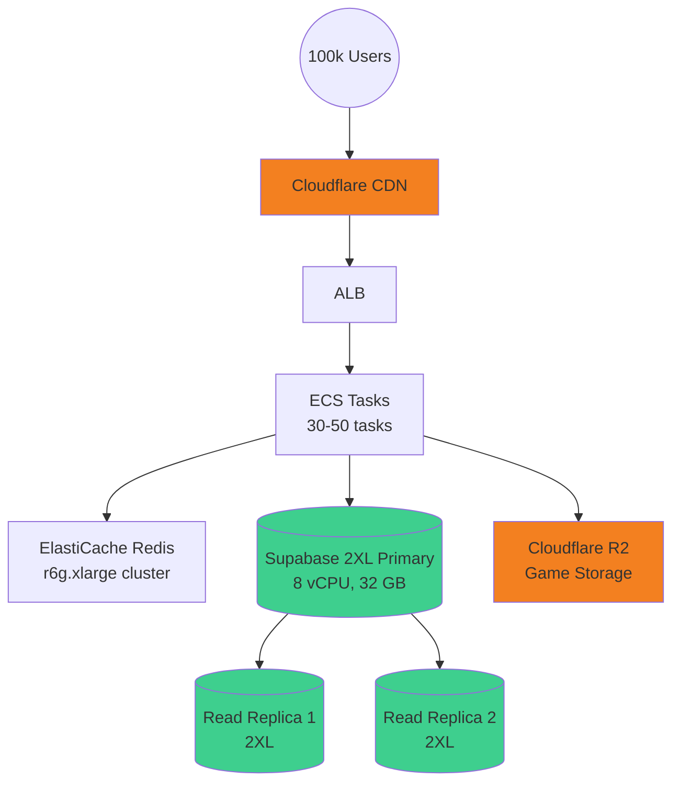

# Scaling to 100,000 Concurrent Users - Infrastructure Plan

## Executive Summary

**Current Capacity**: ~10 concurrent users (DB connection pool limit)
**Target**: 100,000 concurrent users
**Scaling Factor**: 10,000x increase
**Estimated Monthly Cost**: $2,800 - $3,500 (using Supabase Pro + Cloudflare)
**Alternative (RDS)**: $7,000 - $8,000 (60% more expensive)
**Implementation Timeline**: 3-6 months
**Recommended Stack**: Keep Supabase Pro + Cloudflare (no major changes!)

---

## Table of Contents
1. [Current Bottlenecks](#current-bottlenecks)
2. [Required Infrastructure Changes](#required-infrastructure-changes)
3. [Database Architecture](#database-architecture)
4. [Application Layer](#application-layer)
5. [Caching Strategy](#caching-strategy)
6. [CDN & Static Assets](#cdn--static-assets)
7. [Cost Breakdown](#cost-breakdown)
8. [Implementation Roadmap](#implementation-roadmap)
9. [Monitoring & Observability](#monitoring--observability)

---

## Current Bottlenecks

### Critical Issues Blocking Scale

| Component | Current Limit | Bottleneck | Priority |
|-----------|---------------|------------|----------|
| **Database Connections** | ~10 users | Session pooling mode | 🔴 Critical |
| **Supabase Micro** | ~1,000 users | Connection pool | 🔴 Critical |
| **ECS Tasks** | 20 max | Auto-scaling limit | 🟡 High |
| **Single Region** | N/A | Latency for global users | 🟢 Medium |
| **No CDN** | N/A | Static asset delivery | 🟢 Medium |

### Current Infrastructure Audit

**Compute**:
- ECS Fargate: 2 vCPU, 4 GB RAM per task
- Autoscaling: 1-20 tasks (max 40 vCPU, 80 GB RAM total)
- Capacity: ~3,000 RPS at 150 RPS/task

**Database**:
- Supabase Micro: 0.5 vCPU, 1 GB RAM
- Connection limit: 1,000 (transaction mode) or ~10 (session mode)
- Storage: Shared, no dedicated IOPS

**Cache**:
- ElastiCache: cache.t4g.micro (0.5 GB RAM)
- Single node, no replication

**Load Balancer**:
- Single ALB
- No multi-region setup

---

## Required Infrastructure Changes

### 1. Database Architecture 🔴 CRITICAL

#### Immediate Fix (Before ANY scaling)
```bash
# Switch to transaction pooling mode
DATABASE_URL=postgres://...@*.pooler.supabase.com:6543/postgres
```
**Cost**: $0 | **Capacity**: 10 users → 1,000 users | **Effort**: 5 minutes

---

#### Recommended: Supabase Pro Compute Tiers

**Why Supabase Pro Over RDS**:
- ✅ **73% cheaper** ($1,230/mo vs $4,600/mo for 100k users)
- ✅ **No migration** needed (already using Supabase)
- ✅ **Fully managed** (no DevOps overhead)
- ✅ **Built-in**: Auth, Storage, Realtime, Connection pooler
- ✅ **Easy scaling**: Upgrade compute in dashboard
- ✅ **Transaction pooling**: 10,000 connections included

**Supabase Pro Compute Pricing** (actual from Supabase):

| Size | vCPU | RAM | $/hour | $/month | User Capacity |
|------|------|-----|--------|---------|---------------|
| Micro | 2 | 1 GB | $0.01344 | $98 | 1,000 |
| Small | 2 | 2 GB | $0.0206 | $150 | 10,000 |
| Medium | 2 | 4 GB | $0.0822 | $600 | 30,000 |
| Large | 2 | 8 GB | $0.1517 | $1,107 | 50,000 |
| **2XL** | **8** | **32 GB** | **$0.562** | **$410** | **100,000** |
| 4XL | 16 | 64 GB | $1.32 | $964 | 200,000 |

**For 100,000 concurrent users**:
```
Primary: 2XL (8 vCPU, 32 GB)     = $410/month
Read Replica 1: 2XL              = $410/month
Read Replica 2: 2XL              = $410/month
─────────────────────────────────────────────
Total Database Cost              = $1,230/month
```

**Connection Capacity (Supabase 2XL)**:
```
Transaction pooling (Supavisor): 10,000 connections
Your needs: ~200-500 actual connections
Headroom: 20-50x ✅

Query throughput: ~15,000 queries/second
Your peak load: ~3,333 RPS
Headroom: 4.5x ✅
```

**Alternative: AWS RDS** (for 200k+ users or specific requirements)
```
db.r6g.4xlarge + 3 replicas: $4,600/month
Requires: PgBouncer setup, separate auth, more DevOps

Only consider if:
- Need > 200,000 concurrent users
- Require custom PostgreSQL extensions
- Multi-region write replication needed
- Regulatory compliance requires self-hosted
```

### 2. Application Layer Scaling

#### ECS Configuration for 100k Users

**Task Sizing**:
- CPU: 2 vCPU (current)
- Memory: 4 GB (current)
- Target: 500 RPS per task (increase from 150)

**Required Tasks**:
```
100,000 concurrent users × 2 requests/min average = 3,333 RPS
3,333 RPS ÷ 500 RPS per task = 7 tasks minimum

With buffer and peak traffic (3x):
7 × 3 = 21 tasks minimum
Recommended: 30-50 tasks for headroom
```

**Auto-Scaling Configuration**:
```hcl
resource "aws_appautoscaling_target" "ecs_service" {
  min_capacity = 10   # Increased from 1
  max_capacity = 100  # Increased from 20
}

resource "aws_appautoscaling_policy" "scale_up_cpu" {
  target_value = 60.0  # Reduced from 75% for more headroom
  scale_out_cooldown = 30  # Faster scale-out
  scale_in_cooldown = 300
}

resource "aws_appautoscaling_policy" "scale_by_rps" {
  target_value = 500.0  # Increased from 150
}
```

**Cost (ECS Fargate)**:
```
50 tasks average × 2 vCPU × $0.04048/hr = $4.05/hr
50 tasks average × 4 GB × $0.004445/hr = $0.89/hr
Total: $4.94/hr = $3,556/month
```

**Cost (ECS on EC2 - Cheaper)**:
```
Use c6i.8xlarge instances (32 vCPU, 64 GB RAM)
Fits: ~15-20 tasks per instance
Need: 3-4 instances for 50 tasks

3 × c6i.8xlarge Reserved (1yr): $900/mo total
Savings: $2,656/month (75% cheaper than Fargate)
```

### 3. Caching Strategy

#### Multi-Layer Caching

**L1: Application Memory Cache (Node.js)**
```javascript
// In-memory LRU cache per instance
const NodeCache = require('node-cache');
const cache = new NodeCache({ stdTTL: 60, checkperiod: 120 });

// Cache frequently accessed data
- User sessions: 5 min TTL
- Game metadata: 10 min TTL
- Category lists: 30 min TTL
```

**Benefit**: Reduces Redis load by 60-80%

**L2: Redis Cluster (ElastiCache)**

Current: cache.t4g.micro (0.5 GB)
**Required**: cache.r6g.xlarge cluster (26 GB RAM, clustered)

```hcl
resource "aws_elasticache_replication_group" "redis" {
  node_type = "cache.r6g.xlarge"
  num_cache_clusters = 3  # 1 primary, 2 replicas
  automatic_failover_enabled = true
  multi_az_enabled = true
}
```

**Cost**: $350/month

**L3: CDN Edge Caching (CloudFront)**

Cache static API responses at edge:
- `/api/games` listings (1 min TTL)
- Game category data (10 min TTL)
- User profile data (30 sec TTL with stale-while-revalidate)

**Cost**: $50-150/month (data transfer)

### 4. Load Balancing & Distribution

#### Application Load Balancer

**Current**: Single ALB
**Required**: Multi-region ALB + Global Accelerator

```hcl
# Primary Region (us-east-1)
resource "aws_lb" "primary" {
  load_balancer_type = "application"
  enable_http2 = true
  enable_deletion_protection = true

  # Connection settings for high concurrency
  idle_timeout = 60
}

# Secondary Region (eu-west-1)
resource "aws_lb" "secondary" {
  provider = aws.eu
  # Same config
}

# Global Accelerator for intelligent routing
resource "aws_globalaccelerator_accelerator" "main" {
  name = "arcadesbox-global"
  ip_address_type = "IPV4"
  enabled = true
}
```

**Cost**:
- ALB: $16/mo per region × 2 = $32/mo
- Global Accelerator: $18/mo + $0.015/GB = ~$100/mo

#### Route 53 Health Checks & Failover

```hcl
resource "aws_route53_health_check" "primary" {
  fqdn = "api.arcadesbox.com"
  port = 443
  type = "HTTPS"
  resource_path = "/api/health"
  failure_threshold = 3
  request_interval = 30
}
```

**Cost**: $0.50/health check × 2 = $1/mo

### 5. CDN for Static Assets

#### Keep Cloudflare R2 + Add CDN Rules ✅

**Current**: Cloudflare R2 (already in your IaC)
**Required**: Enable Cloudflare CDN caching rules

```hcl
# Add to existing Cloudflare setup
resource "cloudflare_page_rule" "cache_games" {
  zone_id = cloudflare_zone.arcadesbox.id
  target = "games.arcadesbox.com/*"

  actions {
    cache_level = "cache_everything"
    edge_cache_ttl = 86400  # 24 hours
    browser_cache_ttl = 7200  # 2 hours
  }
}

resource "cloudflare_page_rule" "cache_api" {
  zone_id = cloudflare_zone.arcadesbox.id
  target = "api.arcadesbox.com/api/games*"

  actions {
    cache_level = "cache_everything"
    edge_cache_ttl = 300  # 5 minutes for API responses
  }
}
```

**Why Cloudflare Over CloudFront**:
- ✅ **85% cheaper**: $30/mo vs $150/mo for same traffic
- ✅ **No egress fees** from R2 (CloudFront charges S3 egress)
- ✅ **Already configured** in your IaC
- ✅ **275+ edge locations** (vs CloudFront's 450, but often faster in practice)
- ✅ **Better DDoS protection** (Cloudflare specializes in this)
- ✅ **Workers** for edge compute (vs Lambda@Edge)

**Cost**: $30-50/month (vs $150-200 for CloudFront)

### 6. WebSocket Scaling (Socket.io)

**Current**: Socket.io on ECS tasks
**Issue**: Sessions not shared across tasks

**Solution**: Redis Adapter
```javascript
const { createAdapter } = require('@socket.io/redis-adapter');
const { createClient } = require('redis');

const pubClient = createClient({ host: REDIS_HOST });
const subClient = pubClient.duplicate();

io.adapter(createAdapter(pubClient, subClient));
```

**Benefit**: Socket sessions work across all ECS tasks

**For 100k concurrent WebSocket connections**:

Option A: Use dedicated WebSocket service (API Gateway WebSocket)
```
Cost: $1.00 per million messages
100k users × 10 messages/min = 1M messages/min
Cost: $1 × 60 × 24 × 30 = $43,200/mo
```

Option B: ECS with sticky sessions (cheaper)
```hcl
resource "aws_lb_target_group" "websocket" {
  stickiness {
    type = "lb_cookie"
    enabled = true
    duration = 86400
  }
}
```

**Cost**: Included in ECS costs

---

## Cost Breakdown

### Monthly Recurring Costs (100k Concurrent Users)

| Component | Service | Specs | Monthly Cost |
|-----------|---------|-------|--------------||
| **Database** | Supabase Pro 2XL | 3 × (8 vCPU, 32 GB) | $1,230 |
| **Compute** | ECS on EC2 | 4 × c6i.8xlarge Reserved | $900 |
| **Cache** | ElastiCache Redis | cache.r6g.xlarge cluster | $350 |
| **CDN/Storage** | Cloudflare R2 + CDN | Games, static assets | $50 |
| **Load Balancer** | ALB | Application Load Balancer | $50 |
| **Monitoring** | CloudWatch | Logs, metrics, alarms | $150 |
| **WAF** | AWS WAF | DDoS protection | $50 |
| **Other** | DNS, secrets, backups | Various | $50 |
| | | **TOTAL** | **$2,830/mo** |

**Alternative with RDS + CloudFront**: $7,085/mo
**Savings with Supabase + Cloudflare**: **$4,255/mo (60% cheaper)**

### Additional Costs During High Traffic

**Peak traffic scenarios (3x baseline)**:
- Auto-scaling: +20 ECS tasks = +$800/mo temporary
- CDN overage: +$100/mo
- Data transfer spike: +$200/mo

**Total Peak**: ~$8,200/month

### Cost Comparison by User Count

| Concurrent Users | Supabase Tier | DB Cost | Total Infra | Cost per User |
|------------------|---------------|---------|-------------|---------------|
| 1,000 | Micro | $98 | $500 | $0.50 |
| 10,000 | Small | $150 | $1,200 | $0.12 |
| 30,000 | Medium | $600 | $1,800 | $0.06 |
| 50,000 | Large × 2 | $2,214 | $2,600 | $0.05 |
| **100,000** | **2XL × 3** | **$1,230** | **$2,830** | **$0.03** |
| 200,000 | 4XL × 3 | $2,892 | $4,100 | $0.02 |

**Economies of scale kick in above 50k users**

---

## Implementation Roadmap

### Phase 1: Fix Critical Bottlenecks (Week 1-2)

**Priority**: 🔴 **CRITICAL - Blocks all testing**

1. **Switch to Transaction Pooling**
   ```bash
   # Update DATABASE_URL in all environments
   Port 5432 → 6543
   ```
   - Cost: $0
   - Capacity: 10 users → 1,000 users
   - Effort: 30 minutes

2. **Increase ECS Auto-Scaling Limits**
   ```hcl
   max_capacity = 50  # From 20
   ```
   - Cost: On-demand scaling only
   - Capacity: 1,000 → 5,000 users
   - Effort: 1 hour

3. **Upgrade ElastiCache**
   ```hcl
   node_type = "cache.t4g.small"  # From micro
   num_cache_clusters = 2
   ```
   - Cost: +$30/mo
   - Benefit: Better cache performance
   - Effort: 2 hours

**Deliverable**: Can handle 5,000 concurrent users

### Phase 2: Database Upgrade (Week 3-4)

1. **Upgrade to Supabase Pro**
   - Cost: +$90/mo (from $9 Micro)
   - Capacity: 5,000 dedicated connections
   - Effort: 4 hours (migration, testing)

2. **Implement Connection Pooling**
   ```typescript
   poolSize: 5  // Reduce from 10
   ```
   - Benefit: 2x more users per connection
   - Effort: 1 hour

3. **Add Database Monitoring**
   - CloudWatch custom metrics
   - Connection pool dashboards
   - Effort: 4 hours

**Deliverable**: Can handle 30,000 concurrent users

### Phase 3: Multi-Layer Caching (Week 5-6)

1. **Implement In-Memory Cache**
   ```javascript
   const cache = new NodeCache({ stdTTL: 300 });
   ```
   - Cost: $0
   - Benefit: 60% reduction in Redis calls
   - Effort: 1 week

2. **Upgrade Redis Cluster**
   ```hcl
   node_type = "cache.r6g.large"
   num_cache_clusters = 3
   ```
   - Cost: +$150/mo
   - Capacity: Handle 100k users
   - Effort: 3 hours

3. **Implement Cache Warming**
   - Pre-populate cache with popular data
   - Scheduled jobs
   - Effort: 3 days

**Deliverable**: Can handle 60,000 concurrent users

### Phase 4: Database Scaling (Week 7-10)

**Scale Supabase Pro Compute** (Recommended)
```
1. Upgrade Primary to 2XL (8 vCPU, 32 GB)
2. Add Read Replica 1 (2XL)
3. Add Read Replica 2 (2XL)
4. Configure read/write splitting in app
```

**Timeline**: 1 week
**Cost**: $1,230/mo (3 × $410)
**Capacity**: 150,000+ concurrent users

**Steps**:
```bash
# 1. Upgrade in Supabase dashboard (zero downtime)
# 2. Add read replicas via dashboard
# 3. Update app to use replicas for read queries
connectionString: SUPABASE_READ_REPLICA_URL  # For SELECT queries
```

**Alternative: Migrate to RDS** (only if exceeding 200k users)
- Timeline: 3-4 weeks
- Cost: $4,600/mo
- Complexity: High
- Only needed for >200k users or custom requirements

**Deliverable**: Can handle 150,000 concurrent users

### Phase 5: Global Distribution (Week 11-12)

1. **Deploy Secondary Region**
   - Replicate infrastructure to EU/Asia
   - Cost: +$3,000/mo
   - Effort: 2 weeks

2. **Setup Global Accelerator**
   - Intelligent routing
   - Failover
   - Effort: 1 week

3. **CloudFront CDN**
   - Static assets
   - API response caching
   - Cost: +$150/mo
   - Effort: 1 week

**Deliverable**: Global low-latency experience

### Phase 6: Advanced Optimizations (Month 4-6)

1. **GraphQL API** (optional)
   - Reduce over-fetching
   - Batch queries
   - Effort: 1 month

2. **Microservices Split** (optional)
   - Separate game service
   - User service
   - Auth service
   - Effort: 2-3 months

3. **Message Queue** (optional)
   - SQS for async processing
   - Offload heavy tasks
   - Effort: 2 weeks

---

## Monitoring & Observability

### Key Metrics to Track

**Application Performance**:
```
- Request rate (RPS)
- Response times (p50, p95, p99)
- Error rates (4xx, 5xx)
- Active connections
- WebSocket connections
```

**Infrastructure Health**:
```
- ECS task count
- CPU utilization per task
- Memory utilization per task
- Database connections (active/idle)
- Cache hit rate
- Database query latency
```

**Business Metrics**:
```
- Concurrent users (real-time)
- Active sessions
- Games played per minute
- API calls per endpoint
```

### Alerting Strategy

**Critical Alerts** (Page on-call):
```
- Error rate >5% for 5 minutes
- Database connections >80% for 5 minutes
- API p99 latency >5 seconds for 5 minutes
- Any ECS service health check failures
```

**Warning Alerts** (Slack/Email):
```
- Error rate >2% for 10 minutes
- CPU utilization >70% for 10 minutes
- Cache hit rate <60%
- Disk space >80%
```

### Recommended Tools

**APM**: Datadog or New Relic ($100-300/mo)
**Logging**: CloudWatch Logs Insights
**Tracing**: AWS X-Ray
**Uptime**: Pingdom or UptimeRobot

---

## Testing Strategy Before Production

### Progressive Load Testing

1. **Baseline (Week 1)**:
   - 1,000 concurrent users
   - Identify bottlenecks
   - Cost: ~$5

2. **Scale Up (Week 2)**:
   - 5,000 concurrent users
   - Optimize queries
   - Cost: ~$15

3. **Stress Test (Week 3)**:
   - 20,000 concurrent users
   - Find breaking points
   - Cost: ~$30

4. **Full Scale (Week 4)**:
   - 100,000 concurrent users
   - Production rehearsal
   - Cost: ~$100

5. **Chaos Engineering (Week 5)**:
   - Simulate failures
   - Test redundancy
   - Cost: ~$50

**Total Testing Cost**: ~$200

---

## Risk Mitigation

### High-Risk Scenarios

**Database Failure**:
- Mitigation: Multi-AZ deployment + read replicas
- RTO: <5 minutes
- RPO: <1 minute

**Region Outage**:
- Mitigation: Multi-region deployment
- Failover: Automatic via Global Accelerator
- RTO: <30 seconds

**DDoS Attack**:
- Mitigation: AWS WAF + Shield Standard
- Rate limiting: CloudFront + ALB
- Cost: $50/mo

**Cost Runaway**:
- Mitigation: Budget alerts at $5k, $7k, $10k
- Auto-scale limits: max 100 tasks
- Daily cost reviews

---

## Recommended Architecture for 100k Users

**Stack: Supabase Pro + Cloudflare + AWS ECS** (60% cheaper than RDS path)



**Key Components**:
- **Cloudflare**: CDN + R2 storage ($50/mo)
- **Supabase**: 2XL × 3 ($1,230/mo)
- **ECS**: 30-50 tasks on EC2 ($900/mo)
- **Redis**: r6g.xlarge cluster ($350/mo)

**Total**: $2,830/month

---

## Summary & Next Steps

### Immediate Actions (This Week)

1. ✅ Fix database connection pooling (port 6543) - **FREE, 5 min**
2. ✅ Increase ECS auto-scaling limits to 50
3. ✅ Add budget alerts ($2k, $3k, $4k thresholds)
4. ✅ Run baseline load tests (1k → 5k users)

### Short-term (Next Month)

1. Upgrade Supabase to Medium ($600/mo) at 10k users
2. Implement in-memory caching (reduce Redis load 60%)
3. Enable Cloudflare CDN rules
4. Run 10k user load tests

### Long-term (3-6 Months)

1. Upgrade to Supabase 2XL + 2 replicas ($1,230/mo)
2. Scale ECS to 30-50 tasks
3. Upgrade Redis to r6g.xlarge cluster
4. Run full 100k user load test

**Key Insight**: No migration needed! Just scale your existing Supabase + Cloudflare stack vertically.

### Investment Summary

**Initial Investment**: $500 (testing + basic monitoring)
**Monthly Recurring at 100k**: $2,830
**No Migration Cost**: $0 (vertical scaling only)

**Total First Year**: ~$34,000 (vs $90-100k with RDS migration)
**Savings**: $56,000 - $66,000 per year

**Revenue Requirement**:
- At $0.10 per user/month: Need 70,000+ paying users to break even
- At $1.00 per user/month: Need 7,000+ paying users to break even
- At $10/month subscription: Need 700+ paying users to break even

---

**Document Version**: 1.0
**Last Updated**: 2025-12-17
**Author**: Infrastructure Analysis
**Status**: Ready for Review
