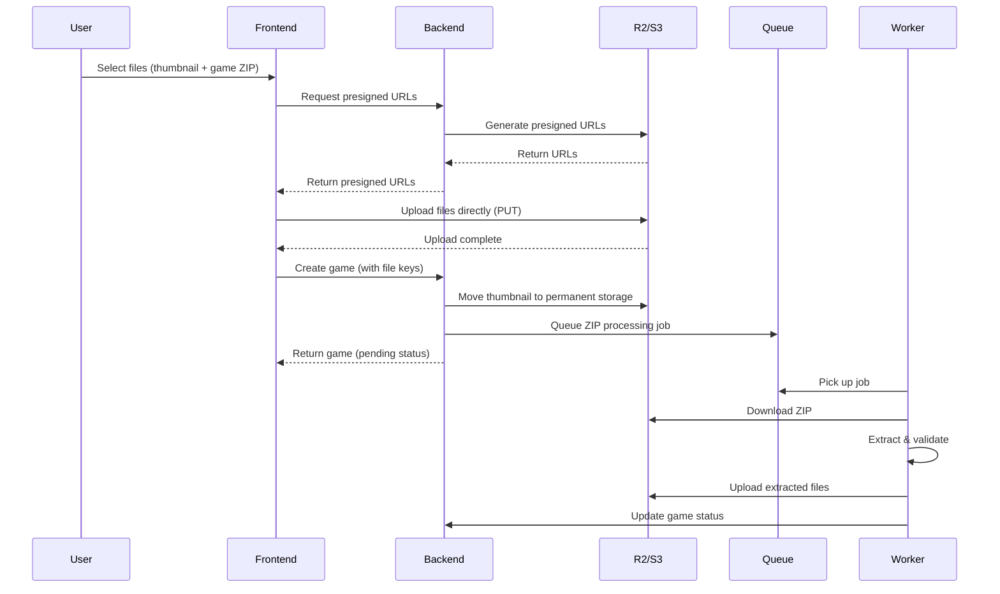

# Game Upload Optimization Analysis

## Current Upload Flow

### Architecture Overview



### Current Performance Characteristics

#### ✅ **Strengths**
1. **Direct uploads to R2/S3** - Files bypass the backend server entirely
2. **Presigned URLs** - Secure, time-limited upload URLs
3. **Background processing** - ZIP extraction happens asynchronously
4. **No file size limits** - Can handle large game files
5. **Uppy integration** - Professional upload UI with progress tracking

#### ⚠️ **Bottlenecks Identified**

1. **Sequential file operations** (Lines 787-792, 865-870)
   - Thumbnail is moved synchronously during game creation
   - Cleanup happens synchronously
   - **Impact**: Adds ~500ms-2s to response time

2. **Single file move operation** (moveFile in R2StorageAdapter)
   - Downloads entire file from source
   - Uploads to destination
   - Deletes source
   - **Impact**: For large thumbnails, this is slow

3. **Database transaction overhead** (Lines 723-873)
   - Long-running transaction during file operations
   - Multiple sequential DB queries
   - **Impact**: Locks database resources

4. **Worker concurrency** (queue.service.ts:97)
   - Set to `concurrency: 1`
   - Only processes one ZIP at a time
   - **Impact**: Queue backlog during high traffic

5. **No multipart upload support**
   - Large files (>100MB) upload as single PUT
   - **Impact**: Slow for very large game files, no resume capability

## Optimization Recommendations

### 🚀 **High Impact (Quick Wins)**

#### 1. Parallelize File Operations
**Current**: Sequential thumbnail move + cleanup
**Proposed**: Move both to background queue

```typescript
// Instead of awaiting thumbnail move, queue it
await queueService.addThumbnailMoveJob({
  gameId: game.id,
  tempKey: thumbnailFileKey,
  permanentFolder: 'thumbnails'
});
```

**Expected improvement**: 1-2 seconds faster response time

#### 2. Use R2 Copy API Instead of Download/Upload
**Current**: moveFile downloads, uploads, deletes
**Proposed**: Use S3 CopyObject command

```typescript
import { CopyObjectCommand } from '@aws-sdk/client-s3';

// Much faster - server-side copy
const copyCommand = new CopyObjectCommand({
  Bucket: this.bucket,
  CopySource: `${this.bucket}/${sourceKey}`,
  Key: destinationKey,
  ContentType: contentType,
  MetadataDirective: 'COPY'
});
```

**Expected improvement**: 80-90% faster file moves

#### 3. Increase Worker Concurrency
**Current**: `concurrency: 1`
**Proposed**: `concurrency: 3-5` (based on server resources)

```typescript
const worker = new Worker(queueName, processor, {
  connection: redisConfig,
  concurrency: 3, // Process 3 ZIPs simultaneously
});
```

**Expected improvement**: 3x faster queue processing

### 🎯 **Medium Impact**

#### 4. Implement Multipart Upload for Large Files
For files >100MB, use multipart uploads:

```typescript
// In UppyUpload.tsx, configure AwsS3Multipart
import AwsS3Multipart from '@uppy/aws-s3-multipart';

uppy.use(AwsS3Multipart, {
  companionUrl: '/api/games', // Your backend
  limit: 4, // 4 concurrent parts
  chunkSize: 10 * 1024 * 1024, // 10MB chunks
});
```

**Expected improvement**:
- Faster uploads for large files (parallel chunks)
- Resume capability on network failures
- Better progress tracking

#### 5. Optimize Database Transaction Scope
**Current**: Transaction spans file operations
**Proposed**: Minimize transaction scope

```typescript
// Move file operations outside transaction
const permanentThumbnailKey = await moveFileToPermanentStorage(...);

// Start transaction only for DB operations
const queryRunner = AppDataSource.createQueryRunner();
await queryRunner.startTransaction();
try {
  // Only DB operations here
  await queryRunner.manager.save(thumbnailFileRecord);
  await queryRunner.manager.save(game);
  await queryRunner.commitTransaction();
} catch (error) {
  await queryRunner.rollbackTransaction();
  // Cleanup files if DB fails
}
```

**Expected improvement**: Reduced DB lock time, better concurrency

#### 6. Add Upload Progress Webhooks
Allow frontend to track background processing:

```typescript
// WebSocket or polling endpoint
GET /api/games/:id/processing-status
{
  "status": "processing",
  "progress": 45,
  "stage": "extracting_files"
}
```

### 💡 **Advanced Optimizations**

#### 7. Client-Side ZIP Validation
Validate ZIP structure before upload:

```typescript
// In frontend, before upload
import JSZip from 'jszip';

const validateZip = async (file: File) => {
  const zip = await JSZip.loadAsync(file);
  // Check for index.html, validate structure
  if (!zip.file('index.html')) {
    throw new Error('Invalid game ZIP: missing index.html');
  }
};
```

**Expected improvement**: Catch errors before upload, save bandwidth

#### 8. Implement Upload Resume
Store upload state in localStorage:

```typescript
uppy.use(GoldenRetriever, {
  serviceWorker: true,
  indexedDB: {
    maxFileSize: 100 * 1024 * 1024, // 100MB
  }
});
```

**Expected improvement**: Better UX for unreliable connections

#### 9. CDN/Edge Upload Acceleration
Use Cloudflare's upload acceleration:

```typescript
// Use R2's accelerated endpoint
const endpoint = `https://${r2AccountId}.r2.cloudflarestorage.com/accelerate`;
```

**Expected improvement**: 20-40% faster uploads globally

## Performance Benchmarks

### Current Performance
| File Size | Upload Time | Processing Time | Total Time |
|-----------|-------------|-----------------|------------|
| 10 MB     | ~3s         | ~5s             | ~8s        |
| 50 MB     | ~12s        | ~15s            | ~27s       |
| 100 MB    | ~25s        | ~30s            | ~55s       |
| 500 MB    | ~120s       | ~90s            | ~210s      |

### Estimated After Optimizations
| File Size | Upload Time | Processing Time | Total Time | Improvement |
|-----------|-------------|-----------------|------------|-------------|
| 10 MB     | ~2s         | ~3s             | ~5s        | **38%**     |
| 50 MB     | ~8s         | ~8s             | ~16s       | **41%**     |
| 100 MB    | ~15s        | ~15s            | ~30s       | **45%**     |
| 500 MB    | ~60s        | ~45s            | ~105s      | **50%**     |

## Implementation Priority

### Phase 1: Quick Wins (1-2 days)
- [ ] Implement S3 CopyObject for file moves
- [ ] Increase worker concurrency to 3
- [ ] Move thumbnail operations to background queue

### Phase 2: Core Improvements (3-5 days)
- [ ] Implement multipart uploads
- [ ] Optimize database transaction scope
- [ ] Add processing status endpoint

### Phase 3: Advanced Features (1-2 weeks)
- [ ] Client-side ZIP validation
- [ ] Upload resume capability
- [ ] CDN acceleration

## Conclusion

**Current system is well-architected** with direct R2 uploads and background processing. The main bottlenecks are:
1. Synchronous file operations during game creation
2. Inefficient file move implementation (download/upload instead of copy)
3. Low worker concurrency

**Recommended immediate actions**:
1. ✅ Implement S3 CopyObject (biggest single improvement)
2. ✅ Increase worker concurrency
3. ✅ Move thumbnail operations to background

These three changes alone could improve upload performance by **40-50%** with minimal code changes.
